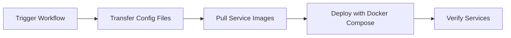

# FMS Infrastructure & Deployment

Infrastructure-as-code repository for deploying FMS microservices to AWS EC2.

## 🎯 Purpose

This repository contains:
- **Docker Compose configuration** - Service orchestration
- **Environment configuration** - Centralized `.env` management  
- **Deployment automation** - GitHub Actions workflows
- **Deployment scripts** - Universal deployment tooling

**Note**: Service source code lives in separate git submodules/repositories.

## 📁 Repository Structure

```
fms/
├── .github/workflows/
│   └── deploy.yml           # GitHub Actions deployment workflow
├── scripts/
│   └── deploy.sh            # Universal deployment script
├── docs/
│   └── DEPLOYMENT_WORKFLOW.md
├── docker-compose.prod.yml  # Production service configuration
├── .env.example             # Environment variables template
└── README.md                # This file
```

## 🚀 Quick Start

### Prerequisites

1. **EC2 Setup**:
   ```bash
   # On EC2 server
   mkdir -p /home/ubuntu/fms
   docker network create fmsnet
   ```

2. **GitHub Secrets**:
   ```bash
   gh secret set EC2_SSH_PRIVATE_KEY < ~/.ssh/your-key.pem
   gh secret set EC2_HOST --body "your-ec2-host"
   gh secret set EC2_USERNAME --body "ubuntu"
   ```

3. **Environment Configuration**:
   ```bash
   # Copy template and configure
   cp .env.example .env
   # Edit .env with your actual values
   vim .env
   ```

### Deploy Services

#### Via GitHub Actions (Recommended)

1. Go to **Actions** tab
2. Click **Deploy FMS Services**
3. Click **Run workflow**
4. Enter services to deploy:
   - `all` - Deploy all 11 services
   - `application-service,user-service` - Deploy specific services

#### Via Command Line

```bash
# Deploy specific services
gh workflow run deploy.yml -f services="application-service,user-service"

# Deploy all services
gh workflow run deploy.yml -f services="all"
```

## 🔧 Configuration

### Environment Variables

All sensitive configuration is managed through `.env` file:

```bash
# Database
POSTGRES_HOST=host.docker.internal
POSTGRES_USER=admin
POSTGRES_PASSWORD=your-password

# Security
SECRET_KEY=your-secret-key

# External Services
MQTT_BROKER_HOST=your-mqtt-host
KAFKA_BROKERS=your-kafka-host:9092
```

See `.env.example` for complete list of variables.

### Service Configuration

Services are defined in `docker-compose.prod.yml`:

```yaml
services:
  application-service:
    image: fms-application-service:stable
    environment:
      - DATABASE_URL=postgresql://${POSTGRES_USER}:${POSTGRES_PASSWORD}@${POSTGRES_HOST}:${POSTGRES_PORT}/applications
      - SECRET_KEY=${SECRET_KEY}
    # ... other configuration
```

## 📦 Services

| Service | Port | Description |
|---------|------|-------------|
| application-service | 8003 | Application & version management |
| user-service | 8002 | User authentication |
| device-core | 8004 | Device telemetry |
| mission-service | 8005 | Mission planning |
| deployment-service | 8006 | Zone & map management |
| dashboard-service | 8007 | Dashboard analytics |
| alert-service | 8008 | Alert processing |
| traffic-management-service | 8009 | Traffic coordination |
| analytics-service | 8010 | Analytics & reporting |
| log-service | 8011 | Centralized logging |
| fmscore-frontend | 3000 | Next.js dashboard UI |

## 🔄 Deployment Workflow



### What Gets Deployed

1. **Configuration files** transferred to EC2:
   - `docker-compose.yml`
   - `.env`
   - `deploy.sh`

2. **Services deployed** using Docker Compose:
   - Pulls latest images (or uses pre-built)
   - Applies environment variables from `.env`
   - Recreates only specified services
   - Verifies containers are running

## 🛠️ Local Development

### Test Configuration

```bash
# Validate docker-compose syntax
docker-compose -f docker-compose.prod.yml config

# Test with .env file
docker-compose --env-file .env config
```

### Deploy Single Service Locally

```bash
# Deploy application-service
docker-compose --env-file .env up -d application-service

# View logs
docker-compose logs -f application-service
```

## 📖 Documentation

- **[DEPLOYMENT_WORKFLOW.md](docs/DEPLOYMENT_WORKFLOW.md)** - Detailed deployment guide
- **[.env.example](.env.example)** - Environment variables reference

## 🔐 Security

### Secrets Management

- ✅ `.env` file is gitignored - never commit it
- ✅ Use `.env.example` as template
- ✅ Store secrets in GitHub Secrets for CI/CD
- ✅ Rotate credentials regularly

### Best Practices

1. **Never commit** `.env` to version control
2. **Use strong passwords** for databases and services
3. **Rotate secrets** regularly
4. **Limit access** to EC2 server and GitHub secrets
5. **Use HTTPS** for all external communication

## 🐛 Troubleshooting

### Service Won't Start

```bash
# Check logs
docker-compose logs service-name

# Check if service is defined
grep "service-name:" docker-compose.prod.yml

# Verify environment variables
docker-compose --env-file .env config | grep service-name -A 20
```

### Environment Variables Not Loading

```bash
# Verify .env file exists on EC2
ssh user@ec2 "cat /home/ubuntu/fms/.env"

# Test locally
docker-compose --env-file .env config
```

### Deployment Fails

1. Check GitHub Actions logs
2. Verify EC2 SSH access
3. Ensure `.env` file is on EC2
4. Verify Docker images exist

## 🤝 Contributing

1. Update configuration in `docker-compose.prod.yml`
2. Update `.env.example` if adding new variables
3. Test locally with `docker-compose config`
4. Create PR to `main` branch
5. Merge to `release` for deployment

## 📝 License

Part of FMS - Internal Use

---

**Last Updated**: 2026-01-09  
**Version**: 3.0.0 (Infrastructure-Only)  
**Maintained By**: DevOps Team
